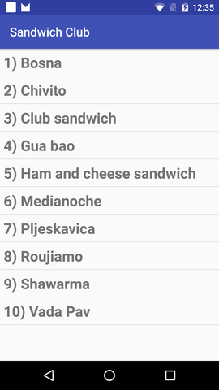
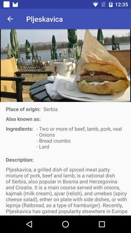

# Sandwich Club Project Starter Code

## Project Overview
A **Sandwich Club** app to
show the details of each sandwich once it is selected.

  

## Why this Project

Building a layout and populating its fields from data received as JSON
is a common task for Android Developers. Although JSON parsing is usually
done using libraries, writing the JSON parsing for  this project will
help you to better understand how it is processed.

## What Will I Learn?
Through this project, you will:
- Learn how to submit projects for review
- Practice JSON parsing to a model object
- Design an activity layout
- Populate all fields in the layout accordingly
